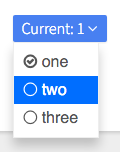

# Dropdown Selector

Dropdown button that behaves like a &lt;select&gt; element.



```jsx
import DropdownSelectorBtn from 'patchkit-dropdown-selector'

const onSelect = o => console.log('selected', o)

const ITEMS = [
  { label: 'one', value: 1 },
  { label: 'two', value: 2 },
  { label: 'three', value: 3 }
]
<DropdownSelectorBtn className="btn highlighted" items={ITEMS} label="Current" initValue={1} onSelect={onSelect} />
```

## Styles

Use the .less file from `patchkit-dropdown`:

```less
@import "node_modules/patchkit-dropdown/styles.less"
```